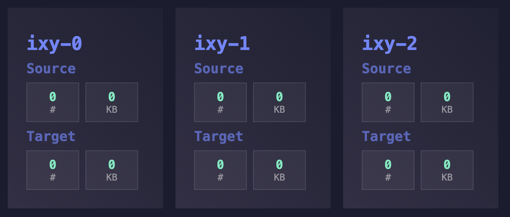

An **i**mage pro**xy** that can resize images from an upstream server and store the source and target images locally for quick response times. In a Kubernetes cluster with multiple replicas _ixy_ synchronizes the source and target images between all replicas. 

## Quickstart with KinD

```bash
$ ./scripts/quickstart.sh
$ google-chrome http://127.0.0.1:30080 # UI
$ curl -o /dev/null \
       -s \
       -w 'Establish Connection: %{time_connect}s\nTTFB: %{time_starttransfer}s\nTotal: %{time_total}s\n' \
       http://127.0.0.1:8080/200/200/300/300
```

## Quickstart with Docker

```
$ docker compose up &
$ curl -o /dev/null \
       -s \
       -w 'Establish Connection: %{time_connect}s\nTTFB: %{time_starttransfer}s\nTotal: %{time_total}s\n' \
       http://127.0.0.1:8080/200/200/300/300
```

## UI

The UI is only available in Kubernetes environment and will reflect the available pods and their synchronization states:



## Environment variables

- `DEBUG`: Enable debug logging
- `BASE_URL`: The base URL of the upstream server
- `MAX_WIDTH`: The maximum width of the target image (Default: `2000`)
- `MAX_HEIGHT`: The maximum height of the target image (Default: `2000`)
- `MAX_SIZE`: The maximum size of the source image in megabytes (Default: `5`)
- `REVALIDATE_TIME`: The time in minutes for checking the source image for changes after its last access (Default: `30`)
- `TIMEOUT`: The timeout in seconds when fetching source images (Default: `15`)
- `MAX_REDIRECTS`: The maximum number of redirects when fetching source images (Default: `5`)
- `CACHE_DIR`: The directory to store the source and target images in (Default: `/home/node/cache`)
- `CACHE_CONTROL_MAX_AGE`: The maximum age of the cache in days (Default: `365`)
